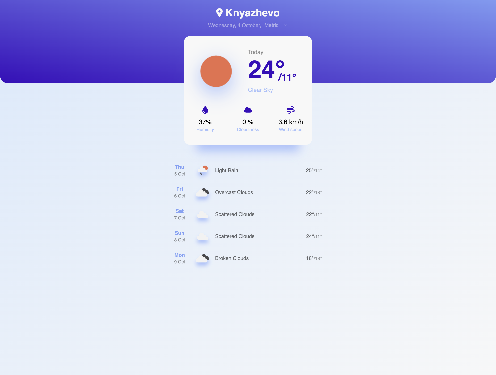
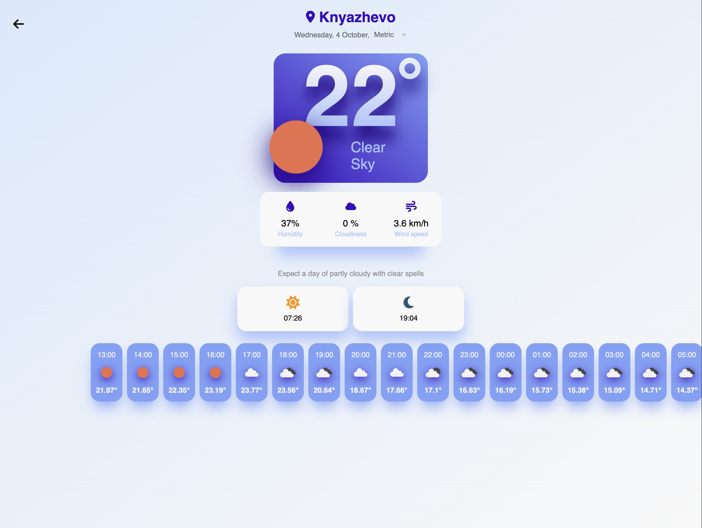
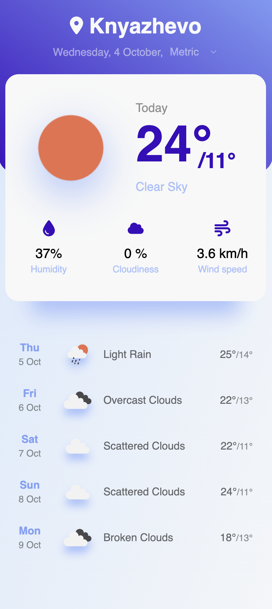
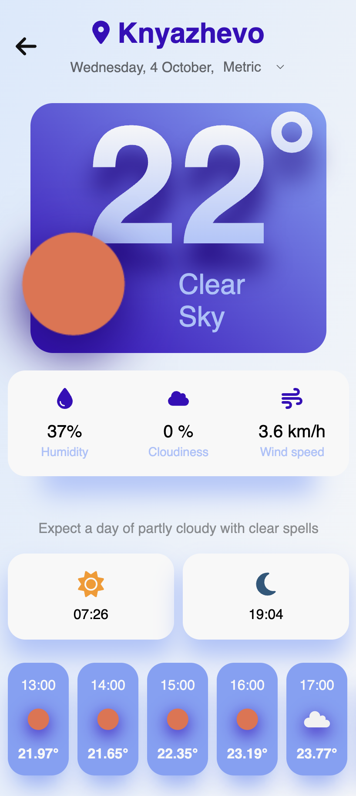

# WeatherMe

Created by Kristiyan Valchev

## Available Scripts

In the project root directory, you can run the following commands:

### `npm start`

Runs the app in the development mode.\
Open [http://localhost:3000](http://localhost:3000) to view it in the browser.

### `npm run build`

Builds the app for production inside a `build` folder in the root directory.\
The build files are minified and the filenames include the hashes.

## Visual look of the product

|                             Desktop view                             |                                Opened desktop view                                |
| :------------------------------------------------------------------: | :-------------------------------------------------------------------------------: |
|  |  |

|                            Mobile view                             |                               Opened mobile view                                |
| :----------------------------------------------------------------: | :-----------------------------------------------------------------------------: |
|  |  |
